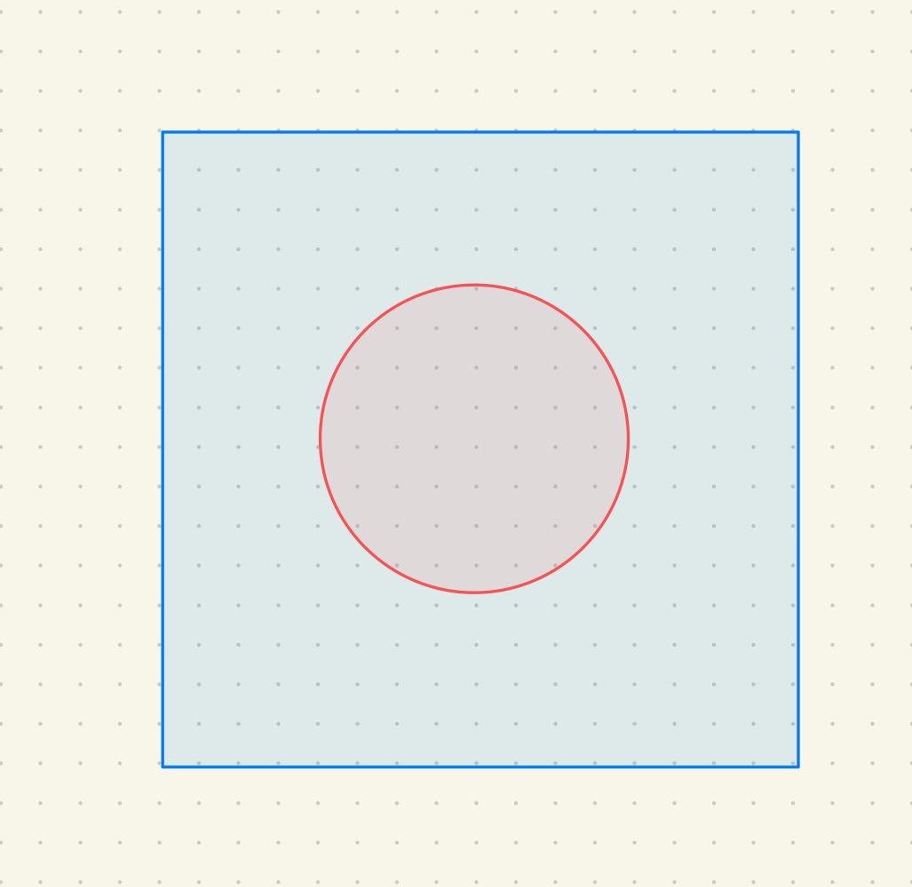
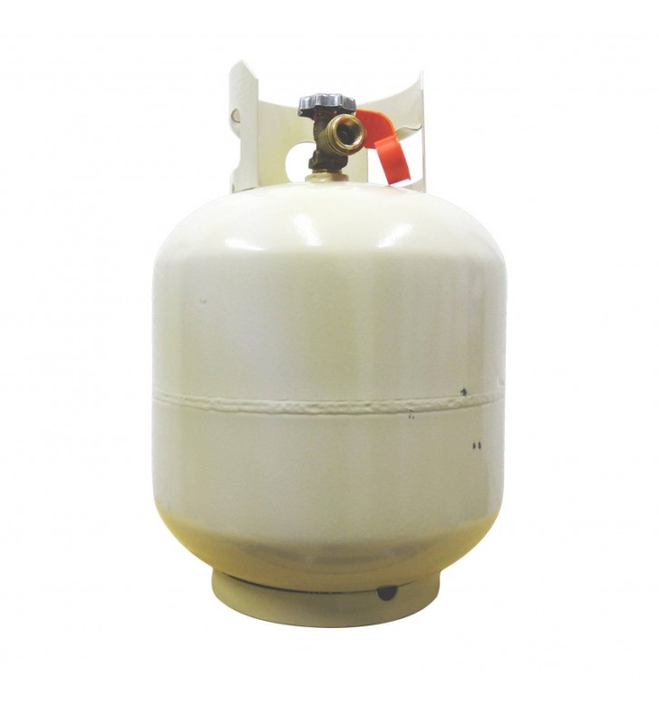

# Aproximación del número PI con el método de Montecarlo ⛰️

---



# Integrantes

* Hernández Arieta Héctor
* Heredia Maas Yesica Sarahi
* Hsiao Tung Ya-Yun
* León Puc Jennifer
* Lopez Ciau Carlos David

---

## ⚜️ Teoría ⚜️

1. Considera un cuadrado de lado 2u, centrado en el origen (0,0). Este cuadrado tiene un área de 4u cuadradas.
2. Dentro de este cuadrado se haya inscrito un círculo de radio 1u, también centrado en el origen. El área de este círculo es π unidades cuadradas.
3. Genera puntos aleatorios uniformemente distribuidos dentro del cuadrado.
4. Cuenta cuántos de estos puntos están dentro del círculo inscrito.
---
5. La razón entre el número de puntos dentro del círculo y el total de puntos generados se aproxima a la razón entre el área del círculo y el área del cuadrado. 
$$\begin{aligned} Razón = \frac{puntos dentro del círculo}{puntos totales} \end{aligned}$$
6. Multiplicando esta razón por 4, obtenemos una estimación de π. 
$$\begin{equation} Razón \times 4 \approx PI \end{equation}$$

---
## ⚜️ Interfaz de paso de mensajes (MPI) ⚜️

**MPI** es un estándar de comunicación utilizado en programación paralela para permitir que procesos en un clúster se comuniquen entre sí y coordinen su trabajo. MPI se utiliza comúnmente en aplicaciones de alto rendimiento y cómputo distribuido.


En Python 🐍 la biblioteca __mpi4py__ proporciona una interfaz para utilizar MPI en scripts Python

---

### 🧩 Características 

* **Comunicadores**: En MPI, los procesos se organizan en grupos llamados "comunicadores". Cada comunicador tiene un conjunto específico de procesos.
* **Envío/Recepción de Mensajes**: MPI permite que los procesos se comuniquen enviando y recibiendo mensajes entre sí. Los mensajes pueden contener datos, como matrices o valores escalares.
* **Operaciones Colectivas**: MPI admite operaciones colectivas que involucran a todos los procesos en un comunicador. Estas operaciones incluyen difusión `(Bcast)`, reducción `(Reduce)`, dispersión `(Scatter)`, recopilación `(Gather)`, entre otras.

---

* **Inicio/Fin MPI**: Se debe inicializar el entorno MPI y se debe finalizar al final del programa.
* **Proceso Raíz**: En operaciones colectivas como la reducción, hay un proceso que actúa como el "proceso raíz" que coordina la operación. En `mpi4py`, se puede especificar el proceso raíz mediante el parámetro root en las funciones colectivas.
* **Ejecución Paralela**: Cuando se ejecuta un programa MPI en un clúster o en una máquina con múltiples núcleos, cada proceso MPI se ejecuta de manera independiente en su propio espacio de memoria, y la comunicación entre procesos se realiza a través de MPI.

---

👨‍🏫 **Ejemplo de uso:**

```python
from mpi4py import MPI

comm = MPI.COMM_WORLD
rank = comm.Get_rank()

data = 5
result = comm.reduce(data, op=MPI.SUM, root=0)

if rank == 0: print(f"La suma total es: {result}")
``````

para ejecutar el script 

```bash
mpirun --oversubscribe -n 6 python suma.py
```

---

 **Código: Script Principal** 👨‍💻​

```python
#!/usr/bin/env python
from mpi4py import MPI
import numpy
import sys

#  inicia un nuevo conjunto de procesos MPI,
#  ejecutando el script cpi.py en cada uno de ellos.
#  maxprocs indica n procesos MPI para ejecutar el script.
comm = MPI.COMM_SELF.Spawn(sys.executable,
                           args=['child.py'],
                           maxprocs=6)
N = numpy.array(10, 'int64')
# envía el valor de N a todos los procesos MPI
# desde el proceso raíz (MPI.ROOT) 
# asegura que todos los procesos tengan 
# el mismo valor de N para su cálculo.
comm.Bcast([N, MPI.INT], root=MPI.ROOT)

PI = numpy.array(0.0, 'float64')

# reduce los valores de PI calculados por cada proceso
# en un solo valor, sumando los valores de PI
comm.Reduce(None, [PI, MPI.DOUBLE],
            op=MPI.SUM, root=MPI.ROOT)
print(PI)

# desconecta el comunicador
comm.Disconnect()
```

---

**Código: Script Secundario** 🐍

```python
#!/usr/bin/env python
from mpi4py import MPI
import numpy

# Obtiene información sobre el comunicador padre
comm = MPI.Comm.Get_parent()

# Obtiene el tamaño del proceso
size = comm.Get_size()
# Obtiene el rango del proceso
rank = comm.Get_rank()

N = numpy.array(0, dtype='int64')

# Recibe el valor de N transmitido por el script padre
comm.Bcast([N, MPI.INT], root=0)

# Calcula el valor de PI
#  con el método de Monte Carlo.
h = 1.0 / N; s = 0.0
for i in range(rank, N, size):
    # print(rank, N, size, i)
    x = h * (i + 0.5)
    s += 4.0 / (1.0 + x**2)
    # print(x, h, s)

# Reduce los valores de PI calculados por cada proceso
PI = numpy.array(s * h, dtype='float64')
comm.Reduce([PI, MPI.DOUBLE], None,
            op=MPI.SUM, root=0)

# Desconecta el comunicador
comm.Disconnect()
```

---



# Tank U

Made by Gatovsky 😺


_Todos los derechos reservados_


